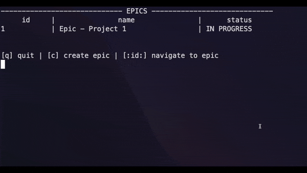

# Jira Clone

## IMPORTANT NOTE

___Please read the project description thoroughly BEFORE getting started.___

## Problem Statement
We will build a Jira clone for the terminal.

We will build two primary features in Jira:
1. Epic CRUD
2. Story CRUD

NOTE: If you're not familiar with Jira, create an [Atlassian account online](https://www.atlassian.com/software/jira) and try it out, or watch a YouTube tutorial.

## Terminologies

__Jira, Epic & Story__

Jira is an industry-standard tool for tracking progress of (not limited to) software projects. An Epic is usually used for entire initiatives, while a Story is a smaller unit of work with more specific instructions.

__Database / Storage / Persistence__

Database, storage and persistence are often used interchangeably. They represent the component we use to store and access information for the application.

__CRUD__

CRUD stands for actions of creation, read, update & deletion.

## Stages
The project is split into multiple stages, each containing steps. Each step has a partially built Rust program with TODO items for you to finish. The TODO items are either `TODO` comments or `todo!()` macros. Most steps will include failing tests which you need to make pass by completing the TODO items. 

Each stage will have it's own README file with more details.

To complete the project go through each stage and step in order.

If you get stuck look at the next step for the solution to the current step.

You can find the final project in the `Solution` folder, one directory up.

## Recommendations
Here's a list of recommended action items to do during and after the development, to help you more effectively build the project and learn from the project.

During Development:
* You can either create your own Rust project and copy over the code in each step or clone this repo and finish the steps directly in this repo. 
* Check the project description/requirements to make sure you are building what is asked of you.
* If you get stuck, as for help in the Discord server or look at the next step for the solution to the current step.
* Refactor as you implement. Keep your code clean and compartmentalized. Doing so makes debugging exponentially easier, as your implementation grows.
* Make your code compiles and all tests are passing before moving on to the next step.

After Development:
* Run through the provided manual test cases (included in the Stage 3 README), and fix any bugs! You are almost done, so finish the project strong!
* Post your completed project on GitHub. You're a Rust developer now!
* Showcase your project to your friends and family (at the very least, to others in the Let's Get Rusty community)!
* After completing the project feel free to modify the program by changing the architecture, adding features, etc. This will help you make the project your own and better internalize the lessons you've learned.

## FAQs

__Will there a template to build the project on top of?__

Yes. Each step has a partially built Rust project for you to finish. Stages and steps build on top of each other until you have a completed project. 

__Should my implementation look exactly like the solution?__

Your code may differ from the solution, as long as your code compiles, tests are passing, and the program works as intended you are in good shape. Also after completing the project feel free to modify the program by changing the architecture, adding features, etc.

__What if I get stuck and have questions?__

If you haven't already, join our Discord server and the exclusive Bootcamp channels as instructed on the Home page of the Bootcamp. Fire away your questions and find project partners over there!

__NOTE:__ `If you don't know how to implement a TODO item, look at the corresponding test to see what is expected.`

## Get Started!

Get started by navigating to Stage 1 and reading the README!