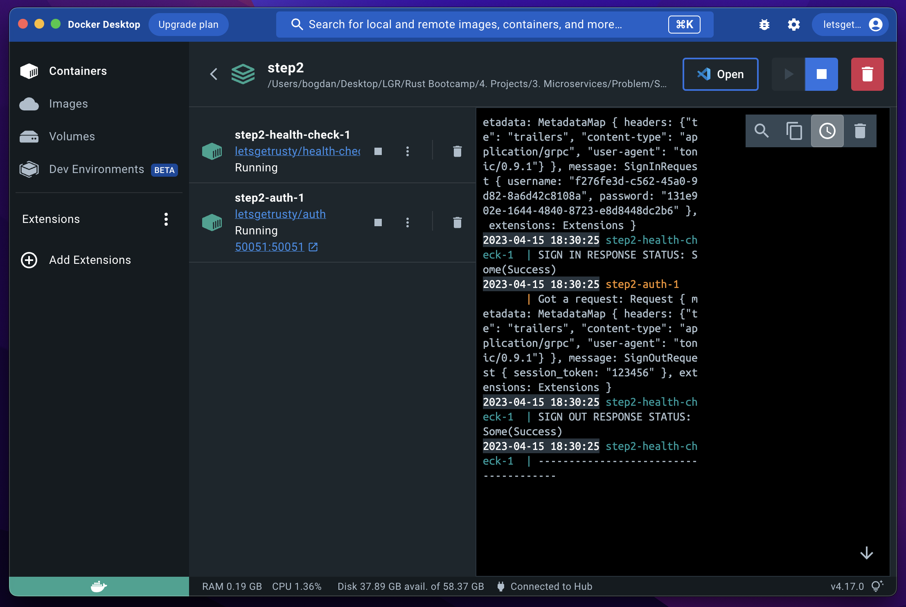

# Auth Microservice

## IMPORTANT NOTE

___Please read the project description thoroughly BEFORE getting started, especially the FAQs section.___

___Re-visit the project description multiple times DURING your design and development process, to ensure you're meeting the project requirements.___

## Problem Statement
We will build a microservice app consisting of 2 services, an authentication service and a health check service. We will also build a client that can communicate with the auth service.

The auth service will have three primary features:
1. Sign in
2. Sign up
3. Sign out

## Objective
In this project, we aim to learn and practice the following:
* Designing, building, and deploying microservices
* Using gRPC to communicate between microservices
* Monitoring the health of microservices
* Setting up continuous integration & continuous deployment
* Using session based authentication
* Writing testable code
* Organizing code using modules
* Navigating and contributing to an existing code base

## Terminologies

__Session based authentication__

[Session based auth](https://www.geeksforgeeks.org/session-vs-token-based-authentication/) works by giving the client a session token which can be used in subsequent requests to authenticate the user.

__Microservices__

[Microservices](https://microservices.io/) is an architectural style that structures an application as a collection of services that are independently deployable, loosely coupled, organized around business capabilities, and owned by a small team.

__CI/CD__

[CI/CD](https://www.redhat.com/en/topics/devops/what-is-ci-cd) (Continuous Integration/Continuous Delivery or Continuous Deployment) is a set of practices and techniques that help software development teams deliver high-quality software faster and more reliably. Continuous Integration refers to the process of frequently merging code changes from multiple developers into a central repository and running automated tests to detect any integration issues early on. Continuous Delivery/Deployment takes this a step further, automating the entire software release process, from building and testing to deploying the application to production. These practices help teams deliver software more frequently and with higher quality, reducing time-to-market and increasing customer satisfaction.

## Recommendations
Here's a list of recommended action items to do during and after the development, to help you more effectively build the project and learn from the project.

During Development:
* __For this project create your own GitHub repo and copy over the code from Stage 1, Step 1. Having your own repro is important for CI/CD to work.__
* Check the project description/requirements to make sure you are building what is asked of you.
* Utilize the included unit tests to help debug your implementation.
* If you get stuck, ask for help in the Discord server or look at the next step for the solution to the current step.
* Refactor as you implement. Keep your code clean and compartmentalized. Doing so makes debugging exponentially easier, as your implementation grows.
* Make sure your code compiles and all tests are passing (if applicable) before moving on to the next step.

After Development:
* Make sure your CI/CD pipeline is working by pushing up code changes and checking if those changes are deployed to production.
* Post your completed project on GitHub. You're a Rust developer now!
* Showcase your project to your friends and family (at the very least, to others in the Let's Get Rusty community)!
* After completing the project feel free to modify the program by changing the architecture, adding features, etc. This will help you make the project your own and better internalize the lessons you've learned.

## FAQs

__Will there be a template to build the project on top of?__

Yes. Each step has a partially built Rust project for you to finish. Stages and steps build on top of each other until you have a completed project.

__Should my implementation look exactly like the solution?__

Your code may differ from the solution, as long as your code compiles, tests are passing, and the program works as intended you are in good shape. Also after completing the project feel free to modify the program by changing the architecture, adding features, etc.

__What if I get stuck and have questions?__

If you haven't already, join our Discord server and the exclusive Bootcamp channels as instructed on the Home page of the Bootcamp. Fire away your questions and find project partners over there!

__NOTE:__ `If you don't know how to implement a TODO item, look at the corresponding test to see what is expected.`

## Stages Overview
The project is split into multiple stages. Please keep in mind, some implementation choices are made to minimize the scope of the project, so we can focus on the learning and implementing Rust related concepts. Here's an overview of the stages:

### Stage 1

__Implementing the services & client__

In this stage we will implement the auth and health check services, set-up communication between them, and create a stand-alone client that can call the auth service.

### Stage 2

__Docker & CI/CD__

In this stage we will "Dockerize" our app, add continuous integration via GitHub Actions, and also implement continuous deployment to DigitalOcean.

## Get Started!

Get started by navigating to Stage 1 and reading the README!