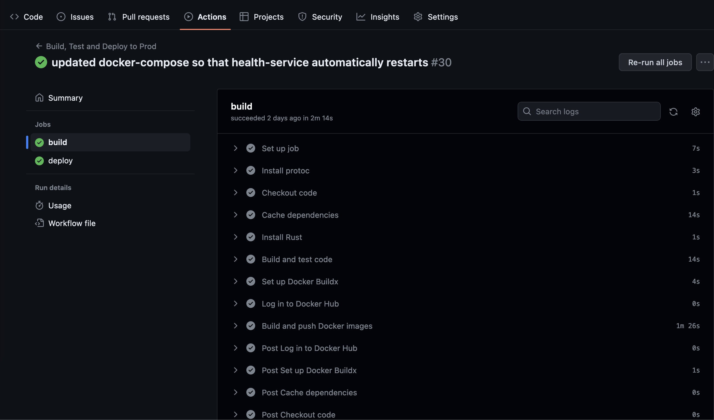
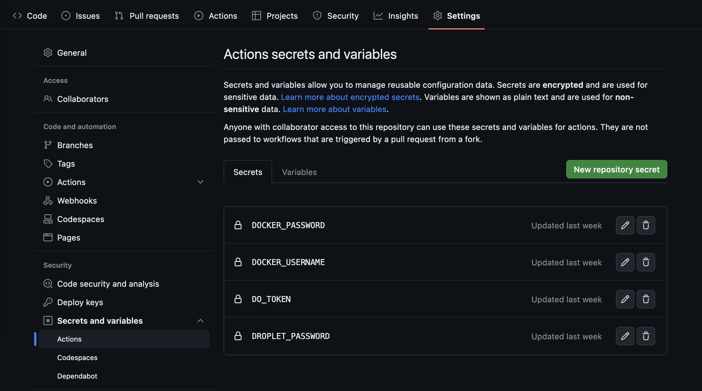
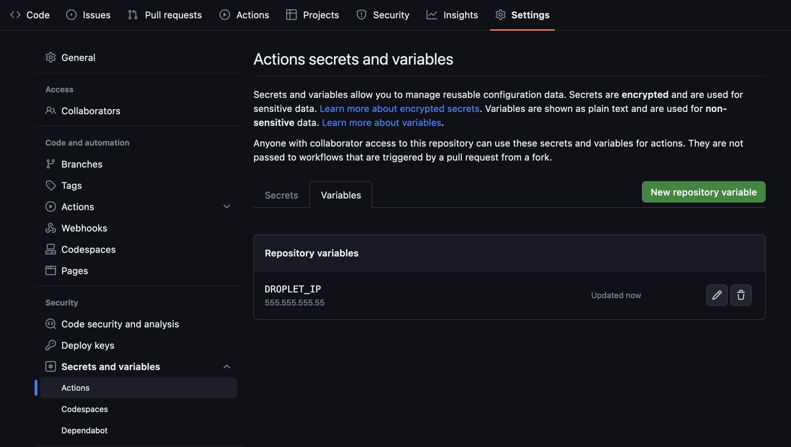

# Stage 2

__Overview__

You now have a functioning app however it only runs on your local machine. In this stage we will go through the process of deploying your app so you can show it off to others! We will also setup continuous integration to prevent new code changes from breaking your app.

## CI/CD Tools

There are the tools we'll be using to setup CI/CD.

### Github Actions

[GitHib Actions](https://docs.github.com/en/actions) allow you to execute arbitrary workflows by simply adding a `YAML` file to your repository.

Here is a great overview video: https://youtu.be/eB0nUzAI7M8

### Docker

[Docker](https://www.docker.com/) is a platform for building, running, and shipping applications in containers. 

Containerization is a technology that allows developers to package an application with all of its dependencies into a standardized unit, called a container, which can be easily deployed across different environments, including local machines, data centers, and cloud providers. Containers are lightweight, portable, and secure, enabling teams to build and deploy applications faster and more reliably.

Docker images are the blueprints or templates used to create Docker containers. An image contains all the necessary files, libraries, and dependencies required to run an application. A container, on the other hand, is a running instance of an image. It's a lightweight, isolated environment that runs the application and its dependencies. Multiple containers can be created from the same image, each with its own unique state and running independently.

Here is a great overview video: https://youtu.be/Gjnup-PuquQ

### DigitalOcean

[DigitalOcean](https://www.digitalocean.com/) is a cloud computing platform that provides virtual servers (called "Droplets") and other infrastructure services to developers and businesses. It offers a simple and intuitive user interface, along with flexible pricing plans that allow users to pay only for what they use. DigitalOcean supports a wide range of operating systems and application stacks, making it a popular choice for hosting web applications, databases, and other workloads.

Here are 2 great overview videos: https://youtu.be/goiq9PZLlEU & https://youtu.be/HODYl1KffDE

## Steps

### Step 1

__Configuring Docker__

Follow these steps to setup Docker:

1. Create an account on [Docker Hub](https://hub.docker.com/). This is where we will push our images.
2. Install Docker Desktop: https://docs.docker.com/get-docker/
3. Launch Docker Desktop
4. Copy over `.dockerignore`, `Dockerfile-auth`, `Dockerfile-health`, and `docker-compose.yaml` to your repository.
5. Inside `docker-compose.yaml` replace "letsgetrusty" with your Docker Hub username.

__File overview__

`.dockerignore`

Similar to `.gitignore` this tells Docker which files/directories it should ignore.

---

`Dockerfile-auth` & `Dockerfile-health`

These are the Docker files for our two services. 

A Dockerfile is a script that contains instructions to build a Docker image. It specifies the base image to use, adds application code, and sets up configuration options. By running a Dockerfile, developers can automate the creation of Docker images, making it easier to deploy and scale applications.

Let's take a look at the contents of `Dockerfile-auth`:

```docker
FROM rust:1.68.2-alpine3.17 AS chef
```

We start with the official Rust image which has all the dependencies we need to build a Rust project.

```docker
RUN apk add --no-cache musl-dev & cargo install cargo-chef
```

Then we install `musl-dev` and [cargo-chef](https://crates.io/crates/cargo-chef). [musl](https://musl.libc.org/) is an implementation of the C standard library built on top of the Linux system call API. [We need it for `cargo-chef` to work](https://github.com/LukeMathWalker/cargo-chef/blob/5f791e86e87db5bf3add5be5a91e0d06b03c42b4/docker/Dockerfile#L6). `cargo-chef` allows us to cache dependencies in our Rust project and speed up your Docker builds.

```docker
FROM chef AS planner
COPY . .
RUN cargo chef prepare --recipe-path recipe.json

FROM chef AS builder
COPY --from=planner /microservice-project/recipe.json recipe.json
# Build dependencies - this is the caching Docker layer!
RUN cargo chef cook --release --recipe-path recipe.json
# Build application
RUN apk add --no-cache protoc
COPY . .
RUN cargo build --release --bin auth
```

Then we run `cargo-chef`, install `protoc`, and build the service  in release mode.

```docker
FROM debian:buster-slim AS runtime
WORKDIR /microservice-project
COPY --from=builder /microservice-project/target/release/auth /usr/local/bin
ENTRYPOINT ["/usr/local/bin/auth"]
```

Finally we create a new bare-bones image, copy over the binary we created in the previous step, and execute it! One of the advantages of Rust is that our apps can be compiled down to a single binary.

---

`docker-compose.yaml`

[Docker Compose](https://docs.docker.com/compose/) is a tool for defining and running multi-container Docker applications. With Compose, you use a YAML file to configure your application’s services. A service is a high-level concept that refers to a set of containers running the same image. Then, with a single command, you create and start all the services from your configuration.

In our case we need to define an auth service and a health check service:

```yaml
version: "3.9"
services:
  health-check:
    image: letsgetrusty/health-check # specify name of image on Docker Hub
    build: # specify which Docker file to use
      context: .
      dockerfile: Dockerfile-health
    restart: "always" # automatically restart container when server crashes
    depends_on: # ensure that `health-check` starts after `auth` is running
      auth:
        condition: service_started
  auth:
    image: letsgetrusty/auth # specify name of image on Docker Hub
    build: # specify which Docker file to use
      context: .
      dockerfile: Dockerfile-auth
    restart: "always" # automatically restart container when server crashes
    ports:
      - "50051:50051" # expose port 50051 so that applications outside the container can connect to it 
```

---

After completing the steps above you should be able to start your application via Docker Compose.

Run `docker-compose up` in the root of your project directory.

You should see console log output from both services in your terminal.

Press `CTRL-C` in your terminal window to stop the services.

Congratulations, you've Dockerized your app and are now ready to deploy it!

### Step 2

__Setting up continuous integration__

Before we talk about continuous deployment let's setup continuous integration. 

Specifically, we will add a GitHub Actions workflow that builds and tests your code before it is merged into master.

Copy over the `.github/workflow/prod.yml` file to your repository. 

This file defines the workflow. Let's go through it:

```yaml
on:
  push:
    branches:
      - master
   pull_request:
    branches:
      - master
```

First we define when we want our workflow to run. In this case we want to run the workflow whenever code gets pushed to master or when a pull request targeting the master branch is created.

```yaml
jobs:
  build:
    runs-on: ubuntu-latest

    steps:
    - name: Install protoc
      uses: arduino/setup-protoc@v1

    - name: Checkout code
      uses: actions/checkout@v2
```

Then we define each step in our `build` job. First we install protoc and checkout the source code.

```yaml
    - name: Cache dependencies
      uses: actions/cache@v3
      with:
        path: |
          ~/.cargo
          target/
        key: ${{ runner.os }}-cargo-${{ hashFiles('**/Cargo.lock') }}
        restore-keys: ${{ runner.os }}-cargo-
```

Then we use the cache action to cache the `/.cargo` and `target/` directories. This will decrease compile times between runs.

```yaml
    - name: Install Rust
      uses: actions-rs/toolchain@v1
      with:
        profile: minimal
        toolchain: stable

    - name: Build and test code
      run: |
        cargo build --verbose
        cargo test --verbose
```

Finally we build and test the app.

---



After adding `.github/workflow/prod.yml` to your repository and pushing the changes up to master, you should see your workflow execute.

### Step 3 (Optional)

__Setting up continuous deployment__

***
THIS STEP IS OPTIONAL BECAUSE IT REQUIRES ABOUT $5 USD TO COMPLETE. YOU WILL HAVE TO PAY DIGITAL OCEAN TO SPIN UP A DROPLET.
***

To setup continuous deployment follow these steps:

1. Create a DigitalOcean account: https://www.digitalocean.com/

2. Create a Digital Ocean droplet. The config I used is listed below but feel free to use your own (*Make sure to use `Password` as the authentication method!*).

    - __Region:__ New York
    - __Data center:__ NYC 1
    - __Image:__ Ubuntu 22.10 x64
    - __Size:__ Shared CPU / Basic / Regular SSD
    - __Authentication Method:__ Password
    - __Hostname:__ rust-microservice-project
    ---
    __NOTE:__ Make sure to save the Droplet's password somewhere safe. We will use it in following steps.

3. Configure droplet

    Now you should have a machine in the cloud (droplet) which you can deploy to. Next we'll configure that droplet by following these steps:

    - SSH into your droplet: https://docs.digitalocean.com/products/droplets/how-to/connect-with-ssh/ 
    - Once connected to your droplet install docker and docker compose:

        ```bash
        sudo apt-get update
        sudo apt-get install docker.io
        sudo apt-get install docker-compose
        ```

4. Update GitHub workflow

    Next we will update our GitHub workflow to deploy the app anytime changes are pushed to master. 
    
    Copy over `.github/workflow/prod.yml` to your repository. Notice that now the workflow only runs when changes are pushed to master (not when creating PRs).

    Let's review the rest of the changes:

    ```yaml
        - name: Set up Docker Buildx
          uses: docker/setup-buildx-action@v2

        - name: Log in to Docker Hub
          uses: docker/login-action@v2
          with:
            username: ${{ secrets.DOCKER_USERNAME }}
            password: ${{ secrets.DOCKER_PASSWORD }}

        - name: Build and push Docker images
          uses: docker/bake-action@v2.3.0
          with:
            push: true
            set: | # cache Docker layers between runs
            *.cache-from=type=gha
            *.cache-to=type=gha,mode=max
    ```

    A few more steps were added to the `build` job. We now build and push the Docker images for our auth and health-check services to Docker Hub. This will allow the deploy step to pull the new images from Docker Hub.

    ```yaml
      deploy:
        needs: build
        runs-on: ubuntu-latest

        steps:
        - name: Checkout code
          uses: actions/checkout@v2

        - name: Log in to Docker Hub
          uses: docker/login-action@v1
          with:
            username: ${{ secrets.DOCKER_USERNAME }}
            password: ${{ secrets.DOCKER_PASSWORD }}
    ```

    A new `deploy` job has also been added. The first couple of steps checkout the source code and log into Docker Hub.

    ```yaml
        - name: Install sshpass
          run: sudo apt-get install sshpass

        - name: Copy docker-compose.yml to droplet
          run: sshpass -v -p ${{ secrets.DROPLET_PASSWORD }} scp -o StrictHostKeyChecking=no docker-compose.yaml root@${{ vars.DROPLET_IP }}:~
    ```
    Next we install `sshpass` to help manage ssh sessions. Then use `scp` to transfer a copy of `docker-compose.yaml` to our droplet. This single file contains all the information needed to build and run our Dockerized app.

    ```yaml
        - name: Deploy
          uses: appleboy/ssh-action@master
          with:
            host: ${{ vars.DROPLET_IP }}
            username: root
            password: ${{ secrets.DROPLET_PASSWORD }}
            script: |
            cd ~
            docker-compose down
            docker-compose pull
            docker-compose up -d
    ```
    Finally we ssh into our droplet and deploy the docker containers.

5. Update Github Secrets & Variables

    You may have noticed that the new `.github/workflow/prod.yml` file has some variables in it (ex: `vars.DROPLET_IP` and `secrets.DROPLET_PASSWORD`). These secrets & variables will need to be defined inside your GitHub repo for the workflow to succeed.

    Secrets are encrypted variables that you can create for a repository. Secrets are available to use in GitHub Actions workflows.

    Add the required secrets by following these steps:
    1. Navigate to your repository on https://github.com/
    2. Click on the `Settings` tab
    3. In the left side-panel click `Secrets and variables` underneath the `Security` section and then click `Actions`.
    4. Add the following secrets
      - `DOCKER_USERNAME` - Your Docker Hub username
      - `DOCKER_PASSWORD` - Your Docker Hub password
      - `DO_TOKEN` - Your Digital Ocean API token. Create a new token by logging into Digital Ocean, clicking on `API` in the left side-panel and then clicking `Generate New Token`. 
      - `DROPLET_PASSWORD` - You droplet password
    
        

    Now that the secrets are defined we will add one regular variable:

    1. Click on the `Variables` tab in GitHub
    2. Create a new variable called `DROPLET_IP` and set the value to your droplet's IP address.

        

    After adding these secrets/variables you should be able to push your updated `.github/workflow/prod.yml` file to the `master` branch and have your project automatically deployed.

6. Check droplet

    After the GitHub workflow finishes deploying your project, check that your app is running by following these steps:

    1. SSH into your droplet https://docs.digitalocean.com/products/droplets/how-to/connect-with-ssh/
    2. Run `docker ps` to see which containers are up

        You should see 2 containers running. Example output:

        ```bash
        root@rust-microservice-project:~# docker ps
        CONTAINER ID   IMAGE                       COMMAND                  CREATED      STATUS        PORTS                                           NAMES
        8805358e487d   letsgetrusty/health-check   "/usr/local/bin/heal…"   4 days ago   Up 4 days                                                     root_health-check_1
        a18f0935f7bb   letsgetrusty/auth           "/usr/local/bin/auth"    4 days ago   Up 17 hours   0.0.0.0:50051->50051/tcp, :::50051->50051/tcp   root_auth_1
        root@rust-microservice-project:~#
        ```

7. Connect to your droplet

    Finally use your local client to connect to the auth service running in your droplet.

    Run the following command in the root of your project folder:
    ```bash
    AUTH_SERVICE_IP=555.555.555.55 cargo run --bin client
    ```

    Replace `555.555.555.55` with your droplets IP address.

## Final Note

Congratulations! You have built fully functioning microservices app in Rust!

You should be proud of your progress if you've gotten this far.

Showcase your implementation and struggles you've faced along the way to others in the Let's Get Rusty community.

More importantly, teaching is the best way to learn. Any questions posted by others in the Discord channels are opportunities for you to answer and truly internalize your knowledge.