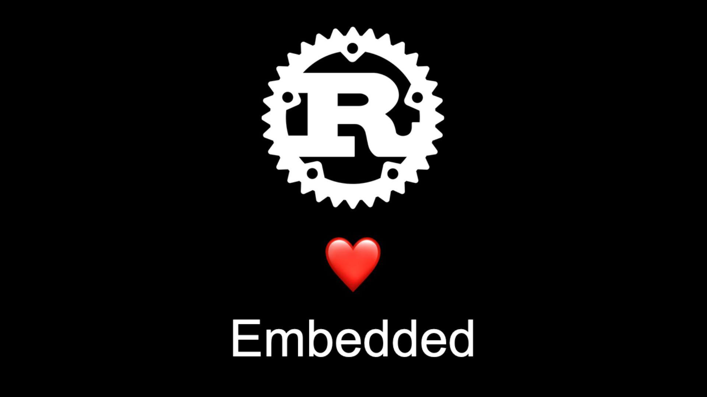

# Custom Embedded Test Runner

## IMPORTANT NOTE

___Please read the project description thoroughly BEFORE getting started, especially the FAQs section.___

___Re-visit the project description multiple times DURING your design and development process, to ensure you're meeting the project requirements.___

## Problem Statement

Rust is rapidly becoming a popular choice in the embedded space due to its inherent memory safety, efficiency, and interoperability with C/C++. In this project, we’ll focus on a critical aspect of embedded systems development: robust and reliable testing under resource-constrained environments.

Imagine you're developing firmware for a compact embedded device, such as an industrial thermostat and a health monitoring device. These devices must operate flawlessly in environments with various constraints typical of embedded systems. Ensuring everything is thoroughly tested is crucial for safe and efficient operations on these devices.

Testing in embedded environments poses unique challenges, including limited memory, restricted CPU power, and the absence of a full operating system. Our goal is to create a custom test runner optimized for Rust’s \`no\_std\` environments, capable of executing tests efficiently within a simulated environment using QEMU. This approach allows us to mimic various configurations and constraints, enhancing both the safety and reproducibility of our testing process across different platforms.

Ready to dive in? Let’s get started :)

## Objectives

* Implement a test runner for embedded systems in Rust.  
* Gain hands-on Rust experience by building an embedded project from the ground up.  
* Learn about embedded system constraints and working within a \`no\_std\` environment.  
* Utilize various Rust crates suitable for embedded systems to enhance functionality.  
* Solidify your Rust skills and apply what you’ve learned in this Bootcamp.

## FAQs

__Why isn't there a definitive solution?__

This project is designed to challenge you to think like a real-world developer. In real-world scenarios, you rarely get step-by-step instructions or definitive solutions for your tasks. Instead, you’re expected to research, experiment, and iterate to find the best solution for the given constraints.
By omitting a definitive solution, this project encourages you to:

* Explore Rust’s \`no_std\` environment independently.
* Gain hands-on experience with tools like the QEMU simulator.
* Build confidence in your problem-solving abilities.
* Ultimately, this approach will better prepare you for tackling complex Rust projects in professional settings.

__Should I submit a pull request for review?__

Absolutely! Submitting a pull request is a critical part of this project. Here’s why:

* Simulates a Real-World Workflow: Pull requests are a standard practice and allow developers to share their work, get feedback, and collaborate effectively.
* Improves Your Code: Code reviews from others can highlight areas for improvement and help you grow as a developer.
* Builds Your GitHub Portfolio: Publishing your work to a public repository adds to your portfolio and demonstrates your skills to potential employers.

So be sure to submit your pull request to our private Discord channel for review, and don’t forget to review your peers’ work as well!

__What if I get stuck and have questions?__

If you haven't already, join our Discord server and the exclusive Bootcamp channels as instructed on the Home page of the Bootcamp. Fire away your questions and find project partners over there!

## Project Requirements

1. Core test runner implementation:  
   - Efficient test registration and execution: Implement a test runner that configures and executes basic unit tests sequentially.
   - Generic assert function: Implement a generic assert function that accepts a closure representing the test logic and an expected result. This function should be capable of handling a variety of data types and comparisons, leveraging Rust's type inference and trait system to provide a flexible assertion mechanism.
     
2. Failed test handling and reporting:  
   - Fail-safe operations: Ensure that the test runner can gracefully handle and report errors.  
   - Result logging: Develop a logging system that provides detailed feedback on test outcomes.
     
3. \`no\_std\` environment:
   - Understand and set up \`no\_std\` environment for the project  
   - Utilize specialized embedded-systems-friendly data structures to minimize memory usage.
     
4. Simulated constraints with QEMU:  
   - Emulation: Select a specific target environment for emulation using QEMU to ensure that tests accurately reflect real-world hardware conditions.  
   - Memory Configuration: Configure memory settings in QEMU, simulating environments with different memory capacities.  
   - CPU Throttling: Simulate various CPU settings to test the test runner’s performance under different processing powers.

## Project Milestones

### **Milestone 1:** Research and environment setup

**Objective:** Establish a solid foundation for no\_std development and configure the necessary tools.

1. Research into test runners  
   - Understand [basic components of a test runner](https://www.fullstackagile.eu/2022/11/30/build-test-runner/), such as registration, execution, assert functions, logging, failing tests, etc.  
   - Understand [how a test runner can be implemented from scratch](https://www.youtube.com/watch?v=G0km0kLEgxY\&list=PLC2LZCNWKL9Z9HFiCRuUb2zOSmGuQ-6Qt).  
2. Research into QEMU  
   - Watch this [Rust embedded tutorial](https://www.youtube.com/watch?v=\_sYnzFe9A6E).  
   - Learn what [QEMU](https://www.qemu.org/) is and what we can use it for.  
   - Experiment with emulating an ARM system, such as [Cortex-M3 microcontroller](https://docs.zephyrproject.org/latest/boards/qemu/cortex\_m3/doc/index.html).  
   - Experiment with a quickstart template like [cortex-m-quickstart](https://github.com/rust-embedded/cortex-m-quickstart).  
3. Set up the Rust \`no\_std\` environment  
   - Research into [what \`no\_std\` Rust is and how to use it](https://rustmeup.com/how-to-use-nostd).  
   - Create a new Rust project using Cargo and configure it to operate in a \`no\_std\` environment by disabling the standard library in your Cargo.toml and source files.  
   - Familiarize yourself with the implications of using \`no\_std\`, such as the lack of certain conveniences provided by the standard library.  
4. Explore relevant Rust crates  
   - Investigate crates like \`[alloc](https://doc.rust-lang.org/alloc/)\` or \`[embedded-alloc](https://crates.io/crates/embedded-alloc)\` for dynamic memory allocation in \`no\_std\` environments, \`[heapless](https://crates.io/crates/heapless)\` for data structures without dynamic memory allocation.  
   - Download and experiment with these crates by creating small Rust projects. The goal is to understand their APIs and how they can be integrated into your project.

### **Milestone 2:** Core functionalities

**Objective:** Implement the fundamental components of the test runner.

1. Implement test registration and execution  
   - Develop a clear architecture for how tests are registered and managed within the test runner. This should include mechanisms for adding tests to a schedule and executing them sequentially.  
   - Initially focus on creating a simple scheduler that executes tests one at a time. This simplifies the implementation and ensures compatibility with environments that have strict memory and processing constraints.  
2. Implement assert function  
   - Consider first implementing a generic \`assert\` function that takes a closure for test logic and an expected result. A more generic \`assert\` function allows for greater flexibility and expressiveness, enabling execution of complex tests through a single function during the development of the test runner. The function should be able to handle any type that implements \`PartialEq\` and \`Debug\` traits, ensuring broad usability.  
   - Consider adding other common assert functions, such as \`assert\_eq\` and \`assert\_ne\`, as future extensions.  
3. Implement result display  
   - Log the results of each test. Present pass, fail, and error states in a readable format. If you’re emulating a Cortex-M3 microcontroller, there’re various [output macros](https://docs.rs/cortex-m-semihosting/latest/cortex\_m\_semihosting/macro.dbg.html) you can utilize.  
   - Ensure that the result display system is integrated with the test execution process, allowing for real-time feedback as tests are run.  
4. Test and execute test runner on QEMU  
   - Deploy the test runner on QEMU to simulate its operation in an embedded environment.

     
### **Milestone 3:** Resource constraints via QEMU

**Objective:** Enhance the test runner to handle and simulate embedded system constraints.

1. Simulate memory limitations  
   - Configure QEMU to simulate limited memory size. This can involve creating several QEMU startup scripts that specify different amounts of RAM.  
2. Simulate CPU throttling  
   - Configure QEMU to simulate limited processing power. This can involve creating several QEMU startup scripts that specify different CPU types and processing speed.  
3. Adjust and optimize test runner  
   - Analyze the performance of the test runner under each simulated environment. Identify performance bottlenecks for the test runner.  
   - Develop and implement optimization strategies aimed at addressing specific issues uncovered during the simulations. This might include refining algorithms, adjusting memory management techniques, or reconfiguring the scheduling logic to better suit constrained environments.  
   - For example, let’s say you have 100 unit tests registered and ready to be executed. After applying memory constraints, you may not have enough memory to run and keep track of all 100 tests. One potential solution would be to register and/or run the 100 tests in batches of 10, which should reduce the amount of memory required.

### **Milestone 4:** Submit code review and review others

**Objective:** Facilitate a peer review process to improve code quality and foster a collaborative learning environment.

1. Prepare code for review  
   - Conduct a self-review of your code to catch and fix any obvious bugs or issues.  
   - Ensure all code is well-documented with comments explaining the purpose of functions and logic, especially parts that handle critical operations like encryption.  
   - Organize the code into a logical structure with function separations and clear modules.  
2. Create a GitHub repository  
   - Initialize an empty repository on GitHub if not already done. **Make sure to set it as a PUBLIC repository.**  
   - Create a descriptive README file that includes project objectives, setup instructions, and how to run the tests.  
   - Commit your project to a new branch (**NOT** the main branch) to prepare for a pull request.  
3. Open a Pull Request (PR)  
   - Open a PR against the main branch of your repository.  
   - Provide a clear description in the PR that outlines what the changes include, the purpose of the code, and any specific areas where you seek feedback.  
   - Post your PR link to the \#code-review channel under the \#bootcamp category on the Let’s Get Rusty Discord server.  
4. **MUST COMPLETE**: Participate in peer reviews  
   - Select **at least** 2 PRs from your peers that are ready for review.  
   - Carefully read through the code and note any areas that are well-implemented or could be improved.  
   - Offer constructive criticism and actionable suggestions. Focus on basic functionalities of a test runner and adherence to \`no\_std\` constraints.
